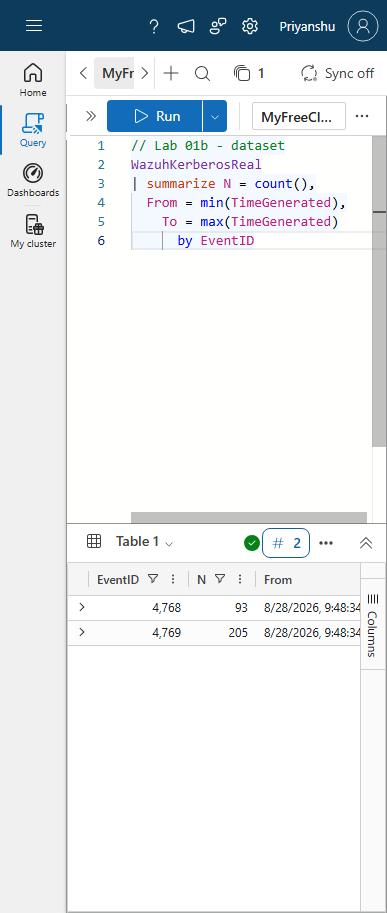
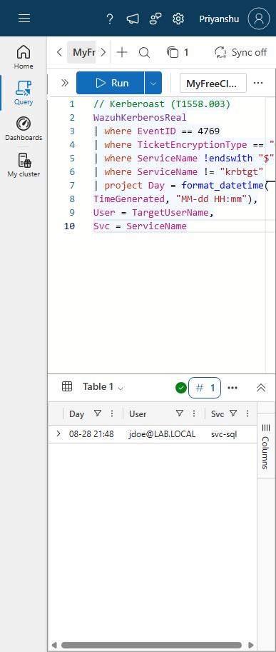
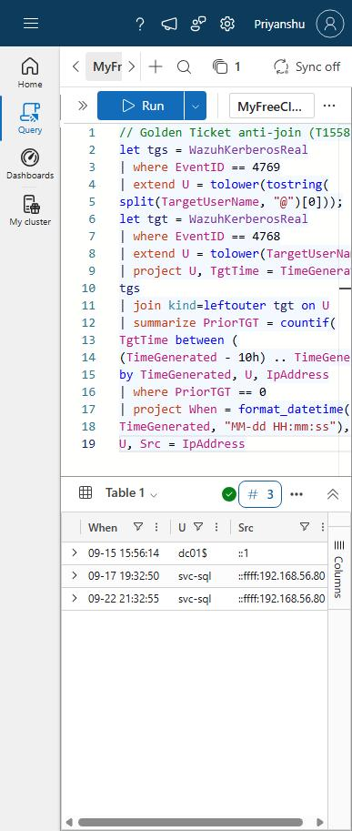
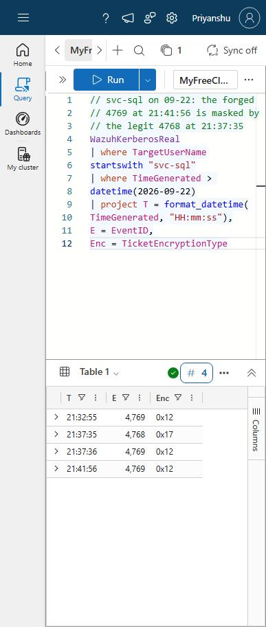
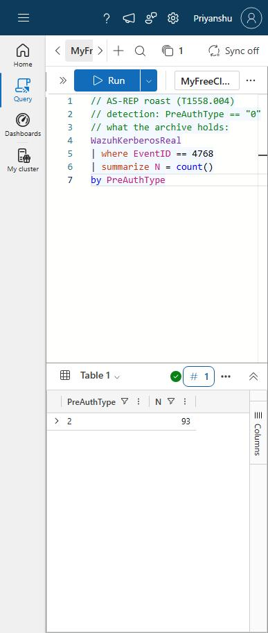

# Lab 01b - Lab 01's KQL Against Real DC01 Telemetry: the Forgery It Missed

## Objective
Lab 01 proved the Kerberos detections on **8 synthetic rows**. This lab runs the same
three detections on **real** DC01 events - every 4768/4769 the Wazuh manager archived
during Modules 06-07, including the actual Kerberoasting and Golden Ticket attacks
from those labs - and records what the queries catch, what they miss, and why.

**This lab uses REAL telemetry, replayed - not live collection.** The events were
exported from Wazuh's archive and loaded into Kusto after the fact. It is not a
Sentinel deployment; there is no agent, no analytics rule, no incident. That is
Lab 03+.

## Framing
| Field | Value |
|---|---|
| Discipline | Detection validation - testing query logic against recorded attacks |
| ATT&CK | T1558.001 (Golden Ticket), T1558.003 (Kerberoasting), T1558.004 (AS-REP Roasting) |
| Engine | Kusto (Azure Data Explorer free cluster) - same KQL as Sentinel |
| Data | 298 real events (93 x 4768, 205 x 4769) from DC01, 2026-08-28 -> 2026-09-23 |
| Source | Wazuh `logs/archives/` (`logall_json`), Modules 06-07 |
| Cost / subscription | None - free cluster, personal Microsoft account |

## Why not Sentinel yet
The personal Azure free trial had already been used and expired, so a Sentinel
workspace needs a pay-as-you-go subscription. The free ADX cluster runs the same
KQL with zero spend, and the attacks were already recorded - so the real data came
to the query engine instead of the other way round.

## Pipeline
1. **Extract** (on the Wazuh manager): a Python script walks every archive file
   (`archives.json` + `2026/*/ossec-archive-*.json.gz`), keeps events with
   `eventID` 4768/4769, and maps Wazuh's field names onto Sentinel's `SecurityEvent`
   column names: [`Lab01b-extract-kerberos.py`](Lab01b-extract-kerberos.py).
   | Wazuh field (`data.win.*`) | Column |
   |---|---|
   | `system.systemTime` | `TimeGenerated` |
   | `system.eventID` | `EventID` |
   | `eventdata.targetUserName` | `TargetUserName` |
   | `eventdata.serviceName` | `ServiceName` |
   | `eventdata.ticketEncryptionType` | `TicketEncryptionType` |
   | `eventdata.preAuthType` | `PreAuthType` |
   | `eventdata.status` | `Status` |
   | `eventdata.ipAddress` | `IpAddress` |
2. **Load**: `.create-merge table WazuhKerberosReal (...)` then `.ingest inline` in
   ~100-row chunks. Row count verified against the source: 93 + 205 = 298.
3. **Query**: the Lab 01 logic, unchanged except for the table name:
   [`Lab01b-KQL-on-Real-Telemetry.kql`](Lab01b-KQL-on-Real-Telemetry.kql).

## Results
| Detection | Hits | Verdict |
|---|---|---|
| Kerberoast (4769, `0x17`, user SPN) | **1** | TP - `jdoe` -> `svc-sql`, RC4, 2026-08-28, from Kali. The Module 06 Lab 02 attack. |
| AS-REP (4768, `PreAuthType == "0"`) | **0** | **Not a detection result** - the attack is not in the archive (see finding 3) |
| Golden Ticket anti-join (no 4768 for the user in the prior 10h) | **3** | 1 TP, 2 FP, **and the Module 07 Lab 04 forgery MISSED** |

### Golden Ticket - row by row
| Hit (UTC, DC time) | User | Source | Verdict | Why |
|---|---|---|---|---|
| 09-15 15:56:14 | `dc01$` | `::1` | **FP** | No archived `dc01$` 4768 between 09-04 and this event - its TGT fell in an archive gap (edge-of-data artifact) |
| 09-17 19:32:50 | `svc-sql` | Kali | **TP** | The Module 07 Lab 02 forged ticket |
| 09-22 21:32:55 | `svc-sql` | Kali | **FP** | Module 07 Lab 04's legit ticket from a pre-existing TGT (stale-TGT case) |
| *(not returned)* 09-22 21:41:56 | `svc-sql` | Kali | **FN** | Module 07 Lab 04's **forged** ticket - masked by the legit 4768 at 21:37:35 |

The `svc-sql` timeline on 09-22 shows the masking directly - the forged 4769 at
21:41:56 sits four minutes after a legitimate 4768, so "does this user have a TGT?"
answers yes:

| Time | Event | etype | What it is |
|---|---|---|---|
| 21:32:55 | 4769 | 0x12 | legit, pre-existing TGT -> **flagged (FP)** |
| 21:37:35 | 4768 | 0x17 | legit TGT (requested with the NT hash, hence RC4) |
| 21:37:36 | 4769 | 0x12 | legit, paired with the 4768 |
| 21:41:56 | 4769 | 0x12 | **forged** -> **cleared (FN)** |

## Findings
1. **On real data the Golden Ticket query is 1 TP / 2 FP / 1 FN.** The miss is the
   exact masking case Lab 01 (finding 3) and Module 07 Lab 04 predicted, now
   reproduced on recorded attacks. KQL removed Wazuh's *expressiveness* limit; it did
   not remove the *logic* limit of a per-user anti-join. A better engine does not
   create a signal the logs do not carry. **Still a triage lead, not an alarm.**
2. **Real data has an FP class synthetic data could not show: edge-of-data.** The
   `dc01$` hit exists only because the archive has a gap (09-04 -> 09-15) and the TGT behind it fell inside it. Any rule whose
   lookback reaches past the start of collection (new connector, retention gap,
   pipeline outage) false-positives on every account with a pre-existing TGT. A
   deployed rule needs a warm-up period after onboarding.
3. **AS-REP = 0 because the archive has gaps, not because the query failed.**
   `PreAuthType` is `2` on all 93 TGTs. The archive holds **no Kerberos events at
   all** for 08-31 -> 09-02 or 09-05 -> 09-14 - the windows in which the AS-REP lab
   (Module 06 Lab 03) and the Module 06 Golden Ticket lab ran. Rule 100601 alerted at
   the time, so the event reached the manager; the raw copy was not retained (why -
   archiving off, or rotated away - is not yet established). **An alert is not
   evidence you can re-query; only retained raw telemetry is.** Validation needs
   complete retention across the attack window.

   
4. **Second normalization trap - the source IP.** Real `IpAddress` is IPv4-mapped
   IPv6: `::ffff:192.168.56.80`, not `192.168.56.80`. Lab 01's synthetic data used
   plain IPv4, so any IP filter or IP-based join copied from it silently matches
   nothing. Also present: `::1` (DC talking to itself, 243 rows) and the DC's own
   IPv6 ULA (45 rows). Normalize before joining on source.
5. **Real Kerberos is almost all housekeeping.** 243 of 298 events are `::1`, and
   only 3 use RC4 - the Kerberoast ticket, `jdoe`'s own TGT just before it (impacket requested RC4), and the NT-hash TGT above. The
   attack traffic is a handful of rows in a noise floor the synthetic set never had.
6. **Collector delay is not constant.** The Module 07 Lab 04 writeup timed these same
   events by manager receive time; this lab uses the DC's `systemTime`. The gap was
   different per event - from 6 to 89 seconds. Rules must use the event time
   the source stamped (Sentinel: `TimeGenerated` vs ingestion time) and tolerate
   late arrival.

## Known limitations
- **Replay, not live collection.** Field mapping was done by hand from Wazuh JSON;
  the real Azure Monitor Agent `SecurityEvent` schema is still unverified (Lab 01
  limitation stands).
- **Small, intermittent dataset.** 298 events over 9 archived days. No statistical
  FP rate can be claimed.
- **Row matching to earlier labs is by sequence.** Timestamps differ from the Module
  07 Lab 04 writeup (finding 6), so rows were matched by event order and type.
- **TGT renewal (4770) still not on the TGT side.**

## Files
- [`Lab01b-extract-kerberos.py`](Lab01b-extract-kerberos.py) - archive -> CSV extractor (runs on the Wazuh manager)
- [`Lab01b-KQL-on-Real-Telemetry.kql`](Lab01b-KQL-on-Real-Telemetry.kql) - table definition and the detection queries
- Screenshots: [`11-Screenshots/10-Sentinel-KQL/`](../11-Screenshots/10-Sentinel-KQL/)
