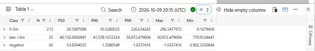
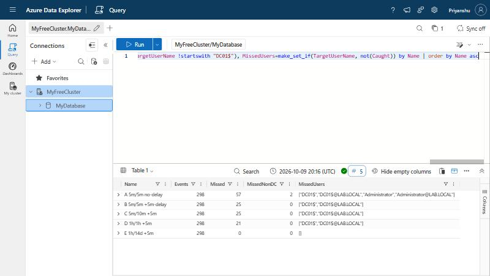
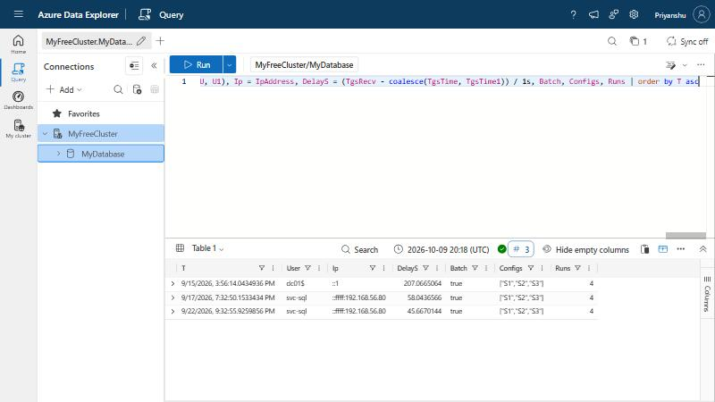

# Lab 02 - Scheduled Rules vs. Late Events: the DC Whose Clock Lied

## Objective
Lab 01b ran the Kerberos detections **once, over all the data**. Sentinel does not work
that way: a scheduled analytics rule is a query on a timer that looks back a fixed
window of `TimeGenerated`. An event that arrives after the run that should have seen it
falls behind the next run's window and never alerts (Microsoft Learn, *Handle ingestion
delay in scheduled analytics rules*). This lab measures how late real DC01 events
actually were, and replays Lab 01b's rules on a schedule to count what that costs.

**This lab is a simulation in KQL, not a Sentinel deployment.** Scheduled runs are
modelled in Azure Data Explorer over replayed real telemetry. No workspace, analytics
rule or incident exists. The behaviour modelled (look-back on `TimeGenerated`, 5-minute
run delay) is taken from Microsoft's documentation, not observed in Sentinel.

## Framing
| Field | Value |
|---|---|
| Discipline | Detection engineering - rule scheduling, data latency, time integrity |
| ATT&CK | T1558.001 (Golden Ticket), T1558.003 (Kerberoasting) - rules from Lab 01b |
| Engine | Kusto (Azure Data Explorer free cluster) |
| Data | Lab 01b's 298 real DC01 events + the Wazuh manager's receive time for each |
| Extra evidence | DC01 `System` channel events from the same archive (Kernel-General 1, Time-Service 12) |
| Cost / subscription | None |

## Pipeline
1. **Extract** - [`Lab02-extract-kerberos.py`](Lab02-extract-kerberos.py) is the Lab 01b
   extractor plus one column: `ReceivedTime` = Wazuh's top-level `timestamp` (when the
   manager received the event). 299 lines = 298 events + header, matching Lab 01b.
2. **Load** - only the new column is loaded: table `WazuhKerbRecv (TimeGenerated, EventID,
   TargetUserName, ReceivedTime)`, keyed on the first three (unique in this data).
   Join check: 298 rows, 298 matched, no duplicates.
3. **Query** - [`Lab02-Scheduled-Rule-Latency.kql`](Lab02-Scheduled-Rule-Latency.kql).

`Delay = ReceivedTime - TimeGenerated`. It mixes two clocks (DC01's and the manager's),
and NTP is not managed in this lab - so a "delay" can be transport time **or** a wrong
clock. Part A separates the two.

## Part A - How late were the events?
| Class | Events | Median | p90 | p99 | Max |
|---|---|---|---|---|---|
| 0-5 min | 213 | 21 s | 50 s | 227 s | 297 s |
| **Late, > 5 min** | **25** | 11.2 h | 11.5 h | 14.2 h | 14.2 h |
| Negative (DC01 clock ahead) | 60 | -54 s | | | -65 min |

**The 11-14 hour "delays" are not delays.** Every one sits on a DC01 boot, and DC01's own
`System` log records the clock being stepped at that moment (Kernel-General event 1):

| Late events | Stamped (DC01) | Received (manager) | DC01 clock change logged |
|---|---|---|---|
| 2 | 08-29 11:51:59 | 08-30 02:01:32 | to 08-30 02:01:04 **from 08-29 11:52:05** |
| 2 | 09-04 02:53:17 | 09-04 14:26:15 | to 09-04 14:25:51 **from 09-04 02:53:17** |
| 2 | 09-16 09:39:17 | 09-16 14:35:04 | to 09-16 14:34:18 **from 09-16 09:39:17** |
| 15 | 09-22 03:01:28 - 03:31:40 | 09-22 14:10:28 - 31 | stepped twice during the 14:09 boot (from 03:31:41, then from 12:08:23 to 14:09:48) |
| 4 | 09-15 21:02:38 | 09-15 21:15:29 | **none nearby** - a real 12.8-min delivery stall, cause not established |

DC01 is a VM. It boots with its clock at wherever it was when last saved, logs its first
Kerberos events with that time, and only then gets corrected. Those events carry a
`TimeGenerated` hours in the past. The same pattern explains the largest negative value:
on 09-03 DC01 booted with its clock **65 minutes ahead** (stepped from 01:25:14 back to
00:19:54).

Every boot also logs Time-Service event 12: DC01 is set to take time from the domain
hierarchy, but as the forest-root PDC emulator there is nothing above it. **The domain's
time authority has no time source.**

## Part B - What would a scheduled rule miss?
A single-event rule (Kerberoast-style) under five schedules. A run at `t` covers
`TimeGenerated` in `[t-L, t]` and executes at `t+X`. An event counts as missed if no run
can see it while it is still inside the look-back.

| Config | Run interval (F) | Look-back (L) | Run delay (X) | Missed / 298 | Missed, not `DC01$` |
|---|---|---|---|---|---|
| A | 5m | 5m | 0 | **57** | 2 (Administrator) |
| B | 5m | 5m | 5m (Sentinel default) | 25 | 0 |
| C | 5m | 10m | 5m | 25 | 0 |
| D | 1h | 1h | 5m | 21 | 0 |
| E | 1h | 14d | 5m | 0 | 0 |

- **Without the run delay (A), 1 event in 5 is lost.** Normal transport (median 21 s,
  tail near 5 min) is enough to push events behind a 5-minute window.
- **The 5-minute run delay absorbs normal transport (B)**. What's left is the 21
  mis-stamped boot events plus the 4 stalled ones.
- **Widening the look-back does not rescue mis-stamped events.** C and D still lose
  them. Only a look-back longer than the clock error (E, 14 days) catches them all.
- **No attack event was late.** The Kerberoast (24 s), the 09-17 forgery (58 s) and the
  09-22 tickets (6-89 s) all arrived quickly. Every miss was `DC01$` housekeeping. That
  was luck of timing, not a property of the rule: an attack in the seconds after a DC
  boot, before the clock was stepped, would have been stamped hours in the past and
  dropped silently.

## Part C - The Golden Ticket anti-join on a schedule
Lab 01b's anti-join, re-run as scheduled rules. On each run, the 4768 that clears a 4769
only counts if it had already arrived by then.

| Ticket | Batch (Lab 01b) | S1 5m/5m | S2 1h/1h | S3 1h/2h | Alerts across S1-S3 |
|---|---|---|---|---|---|
| 09-15 15:56 `dc01$` (archive-start FP) | flagged | flagged | flagged | flagged | 4 |
| 09-17 19:32 `svc-sql` (forgery, TP) | flagged | flagged | flagged | flagged | 4 |
| 09-22 21:32 `svc-sql` (stale-TGT FP) | flagged | flagged | flagged | flagged | 4 |

- **Scheduling changed nothing about what is flagged.** Same 3 tickets as batch; the
  masked forgery from Module 07 Lab 04 is still missed. Scheduling cannot fix a logic gap.
- **Overlapping windows multiply alerts.** S3 (2h look-back, hourly) flags each ticket
  on 2 runs - 4 alerts per ticket across the three configs instead of 3. A look-back
  wider than the interval needs alert grouping or suppression, or the queue double-counts.
- **Self-correction worth recording:** the first version reported **20** tickets. The
  17 extras were all mis-stamped `DC01$` tickets that Part B had already counted as
  missed. KQL's `range(start, stop, step)` returns `[start]` when start > stop, so events
  no run could see were given one phantom run. A `where TgsTime between ((t - L) .. t)`
  guard fixed it. Check a simulator against an independent result before trusting it.

## Findings
1. **A wrong clock at the source is a silent detection blind spot.** 21 of 298 events
   (7%) were stamped hours in the past by a DC that booted with a stale clock. Any rule
   that filters on `TimeGenerated` drops them without error. They are not late - they
   are mis-dated, and a longer look-back only helps if it exceeds the clock error.
2. **The DC that issues Kerberos tickets has no time source.** Time-Service event 12 on
   every boot. In production the forest-root PDC emulator must sync to a reliable
   external source; Kerberos allows only 5 minutes of skew, and every domain member
   takes its time from the hierarchy rooted here.
3. **Microsoft's 5-minute run delay matters.** Without it a 5m/5m rule lost 19% of
   events here; with it, normal transport loss went to 0.
4. **Measure delay per source before setting look-backs.** Here the normal p99 was
   227 s, but there was also an unexplained 12.8-minute stall. A look-back sized from the
   median would not cover that.
5. **Wider look-backs mean duplicate alerts.** Plan suppression or grouping together
   with the look-back, not afterwards.

## What I would do in Sentinel
- Rules on critical sources: windowing on `ingestion_time()` rather than `TimeGenerated`
  (the pattern Microsoft documents for delayed data), so a mis-dated event is still seen
  exactly once. **Not measured here** - ADX's ingestion time is the bulk-load time of the
  replay, so this lab cannot test it.
- A health rule that alerts when `ingestion_time() - TimeGenerated` is outside a band
  for a host (here: > 15 min or < -5 min), and alerts on Kernel-General event 1 on DCs.
- Fix the root cause: give the PDC emulator a reliable external time source. Not changed
  in this lab.

## Known limitations
- **Simulation, not Sentinel.** The run model (look-back on `TimeGenerated`, run delay X,
  run grid aligned to the clock) follows the documentation. Real rule run times are
  aligned to when the rule was enabled, not to the clock.
- **The manager's receive time stands in for Sentinel ingestion time.** A real pipeline
  (AMA -> Log Analytics) has its own latency profile.
- **Delay mixes two unsynced clocks.** Sub-minute values are not purely transport.
- **Small dataset**, 9 archived days, attack events all well inside normal delay.

## Files
- [`Lab02-extract-kerberos.py`](Lab02-extract-kerberos.py) - Lab 01b extractor + `ReceivedTime`
- [`Lab02-Scheduled-Rule-Latency.kql`](Lab02-Scheduled-Rule-Latency.kql) - table, join check, Parts A-C
- Screenshots: [`11-Screenshots/10-Sentinel-KQL/`](../11-Screenshots/10-Sentinel-KQL/)
